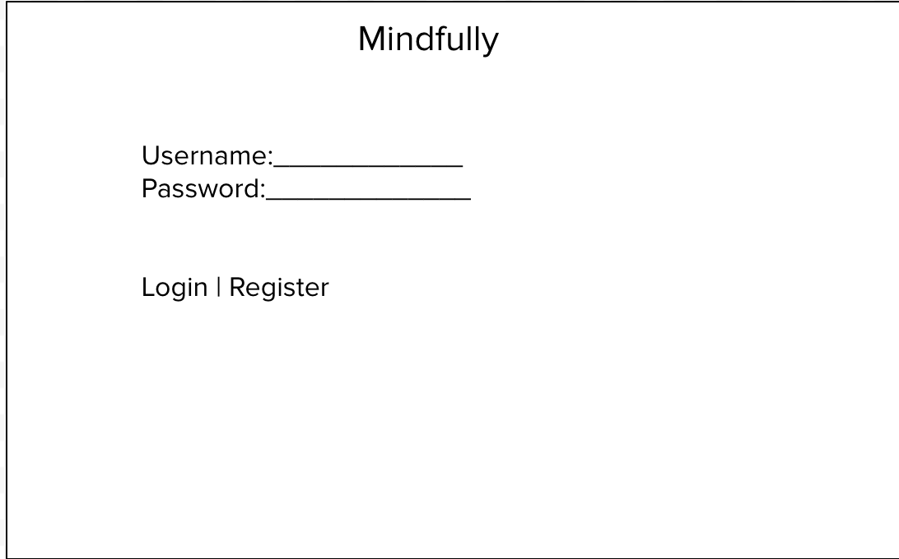
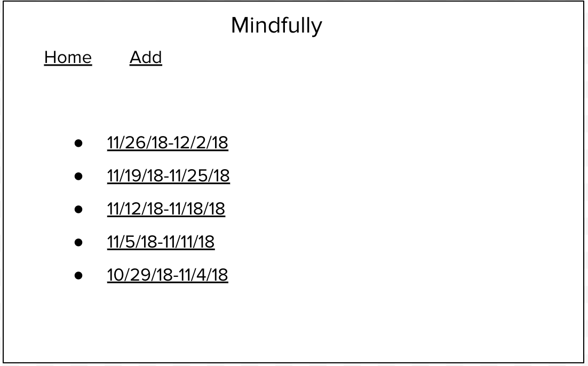
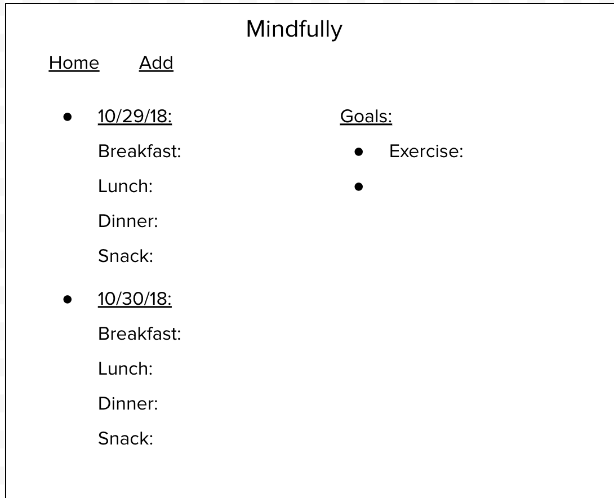
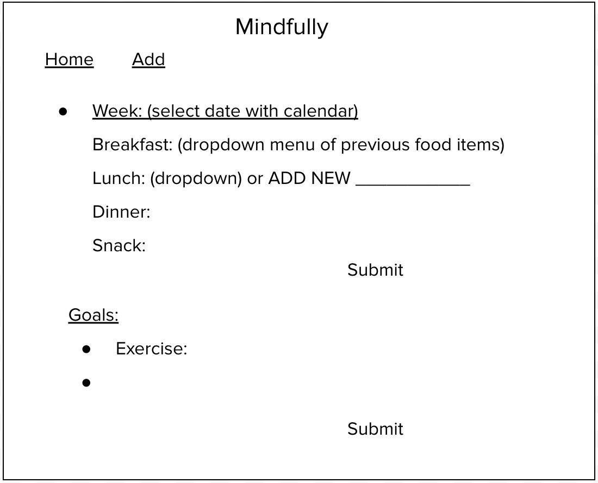
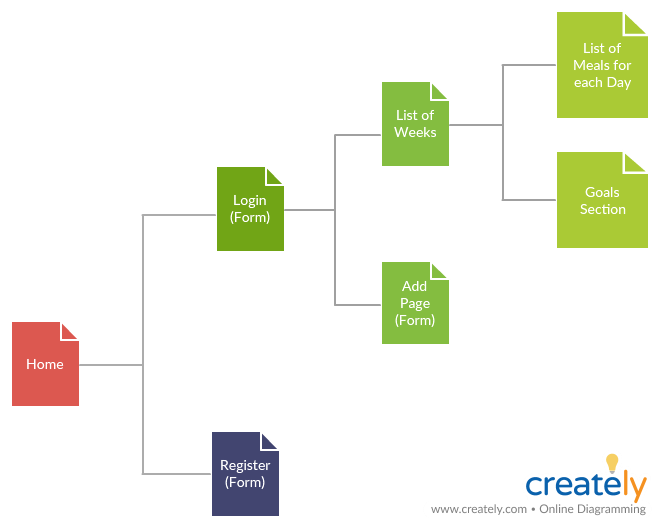

# Mindfully (Food Journal) 
Link to final project: https://connie-final-project.herokuapp.com/
## Overview

Other health and weight loss apps are so focused on the number of calories consumed and burned which can be a big turn off for someone on their weight loss journey. There are definitely benefits in keeping track of every detail, but as someone that's tried this method it just felt more stressful when you have to get the exact grams or oz when portioning food that I easily give up.

Mindfully is a web app that will allow users to keep track of what they're eating and maintain a mindful, balanced, and healthy lifestyle. Once they're logged in, they can create the weeks and add food items for each day. Users can also create small daily goals to be mindful of keeping active and drinking enough water.

## Data Model

The application will store Users, Weeks, and Days

* user can create their own weeks when tracking
* each week has multiple days (preferably lists from Monday - Sunday)
* each day contains the meals consumed and daily goals

An Example User:

```javascript
{
  username: "gogreengolean",
  hash: // a password hash,
  weeks: // an array of references to Week documents
}
```

An Example Week:

```javascript
{
    user: // a reference to a User object
    start_date: "11-05-2018", //should begin on a Monday
    end_date: "11-11-2018", //should end on a Sunday
    days: [Day]
}
```

An Example Day:

```javascript
{
    breakfast: "hard boil egg",
    lunch:  "chicken breast sandwich",
    dinner: "chinese vegetables, pork ribs, tomato egg",
    snack: "HK milk tea from boba guys",
    goals: {exercise: "10,000 steps"} //list of daily exercise or water goals
}
```

## [Link to Commented First Draft Schema](db.js) 

## Wireframes

/ - page for logging in or registering



/home - page for showing all the weeks



/week - page for each week and the days with all the meals



/add - page for selecting week, and inputting meals and goals



## Site map



## User Stories or Use Cases

1. as non-registered user, I can register a new account with the site
2. as a user, I can log in to the site
3. as a user, I can create a new week
4. as a user, I can add food or drink items for each day of the week
6. as a user, I can create daily exercise or water goals

## Research Topics

* (5 points) Integrate user authentication
    * use passport.js for login, password, and register
    * account will be made for testing
* (2 points) CSS Framework
    * use Foundation for CSS Framework
    * use forms layout system for add, login, filter, and register page
* (3 points) perform client side form validation using custom Javascript
    * error messages must be integrated into the DOM
    * error message appears when invalid input is entered in Add form

10 points total out of 8 required points

## [Link to Initial Main Project File](app.js) 

## Annotations / References Used

1. [passport.js authentication docs](http://passportjs.org/docs) - (add link to source code that was based on this)
2. [Foundation CSS Framework](https://foundation.zurb.com/sites/docs/) - (https://foundation.zurb.com/sites/docs/forms.html)
